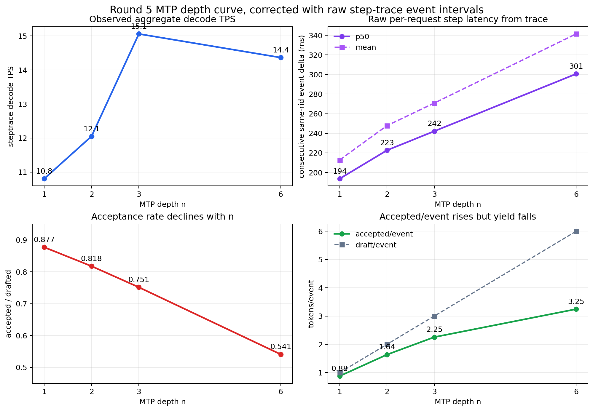

# Round 5 Follow-up Plan — FP8-KV, D-Pro, and MTP Latency

**Generated:** 2026-05-25
**Status:** living follow-up doc. Continue here after F_b lands.
**Goal:** preserve the next Round 5 actions in one place: remeasure Config D
and Config E3 under true FP8 KV-cache, evaluate D-Pro suffix-trie recovery, and
track MTP-depth latency math so future F_b/D-Pro results are compared against
the same baseline.

After F_b lands, append its canary/probe results to this document rather than
creating another standalone Round 5 note.

Execution order:

1. **Remeasure known-good surfaces under realized FP8 KV**:
   `D-og-fp8`, `E3-fp8`, and `F_b-fp8` if F_b has landed.
2. **Then run the D-Pro series** if the FP8-KV baseline still leaves D/E/F_b
   unresolved or if D-Pro-0 shows suffix trie headroom.
3. Keep all rows tied back to the same Round 5 slice, instrumentation, and
   configured-vs-realized KV distinction.

---

## Why this exists

The Round-5 B=4 sweep compared:

| Run | Config | Speculation | Realized KV |
|---|---|---|---|
| `q36a_D_b4` | D | suffix stack | `auto` / likely BF16 |
| `q36a_E3_b4` | E | `qwen3_5_mtp`, linear depth 3 | `auto` / likely BF16 |

The bundles requested `kv_cache_dtype: fp8_e5m2`, but
`ModelServer._initial_kv_cache_dtype()` rewrites FP8-checkpoint +
`fp8_e5m2` KV to `auto`, and the run metrics report
`vllm:cache_config_info{cache_dtype="auto", ...}`. Therefore the existing
D/E3 comparison is fair between D and E3, but it does **not** answer whether
FP8 KV improves the Qwen3.6 FP8 serving stack.

This remeasure pair answers that one question:

```text
same task slice, same temperature, same B=4, same D/E3 speculation
only change: realized KV cache dtype = FP8
```

---

## Runs to create first — FP8-KV controls

Use explicit tags so they cannot be confused with the current `auto`/BF16-KV
baseline:

| New tag | Control tag | Config | Speculation | Required realized KV |
|---|---|---|---|---|
| `q36a_D_og_fp8kv_b4` | `q36a_D_b4` | D-og | suffix stack | FP8 |
| `q36a_E3_fp8kv_b4` | `q36a_E3_b4` | E | `qwen3_5_mtp`, linear depth 3 | FP8 |
| `q36a_Fb_fp8kv_b4` | F_b BF16/auto-KV canary/probe | F_b | batched MTP paths | FP8 |

`q36a_Fb_fp8kv_b4` is conditional: create it only after F_b has landed and has
passed its non-FP8 canary/correctness gates. Do not block the D-og/E3 FP8-KV
remeasure on F_b if F_b is still under implementation.

Fixed conditions:

- same 16 SWE-Bench Verified astropy instances:
  `docs/reports/auto_research/swe-bench-concprobe16-verified-instances-20260522.json`
- `B=4`
- `temp=0.6`, `top_p=0.95`
- `agent_wall_s=1800`
- `eval_timeout_s=1800`
- same x86 runner / DGX serving topology as `round5-b4-sweep-runbook-20260525.md`
- same steptrace and `per_req_spec_trace.jsonl` instrumentation

---

## Required config-surface fix

Do **not** rerun by only setting `kv_cache_dtype: fp8_e5m2` in the bundle. That
is the stale path that currently becomes `auto`.

Before launching, add a narrow config/runtime path that can request a vLLM KV
dtype that actually resolves to FP8 for this checkpoint. Candidate names to test
against the installed vLLM surface:

```text
fp8
fp8_e4m3
fp8_e5m2
```

The first smoke goal is not SWE-Bench. It is engine startup plus this proof:

```text
vllm:cache_config_info{cache_dtype="fp8" ...}
```

or the exact concrete FP8 label vLLM emits.

If vLLM rejects all FP8 KV dtypes for the Qwen3.6 FP8 checkpoint, stop and
record the blocker. Do not silently fall back to `auto`.

---

## Preflight gates

### Gate 0 — realized dtype proof

For each candidate runtime dtype:

1. Launch a tiny smoke server.
2. Capture startup log line:
   `dtype=... kv_cache_dtype=...`
3. Capture `/metrics`:
   `vllm:cache_config_info{cache_dtype=...}`
4. Fail closed if realized dtype is `auto`.

### Gate 1 — distribution / correctness sanity

Because FP8 KV changes attention numerics, this is not just a drafter-side
change. Run B-1/B-2/B-3 before the 16-task SWE run:

- greedy byte-exact where applicable
- fixed-prompt KL / logprob tolerance
- short Codex smoke with no malformed output/tool-call regression

If FP8 KV violates the gate, do not run the expensive pair.

### Gate 2 — instrumentation sanity

For D-og-fp8, E3-fp8, and F_b-fp8 smoke calls, verify:

- steptrace counters advance
- `per_req_spec_trace.jsonl` rows are valid JSON
- D has suffix drafting active
- E3 has `draft=3` rows
- F_b has the expected number of submitted linear paths and per-path verifier
  rows, once available
- metrics still expose realized FP8 KV after requests

---

## Measurement math

Use the same math as:

`docs/reports/auto_research/swe-bench-config-decode-comparison-spec-20260525.md`

Primary speed is run-level steptrace:

```text
steptrace_decode_tps =
  delta(vllm:generation_tokens_total)
  / delta(vllm:request_decode_time_seconds_sum)
```

Do not promote task-local `decode_sum_s` under B=4; it is overlap-contaminated.

Report at minimum:

```text
D-og, D-og-fp8, E3, E3-fp8
```

If F_b has landed, also report:

```text
F_b, F_b-fp8
```

For each row:

1. resolved / 16
2. steptrace decode TPS
3. accept ratio
4. draft/event
5. accepted/event
6. timeout count
7. dormant seconds and active generation percentage
8. configured KV dtype and realized KV dtype

---

## Decision rules

FP8 KV is a win if:

- B-1/B-2/B-3 pass
- realized KV is actually FP8
- resolved count is no worse than the paired `auto`/BF16-KV control, or any
  drop is understood and acceptable
- steptrace TPS improves meaningfully:
  - `D-og-fp8` vs `D-og`: at least +5%
  - `E3-fp8` vs `E3`: at least +5%
  - `F_b-fp8` vs `F_b`: at least +5%, if F_b exists

If FP8 KV helps E3 but hurts D, keep the result separated by drafter. Suffix
decoding and MTP may stress attention/KV differently.

If FP8 KV is neutral or worse, keep current `auto`/BF16 KV and do not spend
kernel effort on FP8 tree-attn until there is a separate reason.

---

## Expected outcomes to watch for

Possible outcomes:

1. **FP8 KV improves both D and E3.** Promote FP8 KV as a new baseline regime,
   then rerun any future F/tree experiment in that regime.
2. **FP8 KV improves E3 only.** Native MTP is more bandwidth-bound on KV than
   suffix D, or D's CPU/proposer overhead masks the gain.
3. **FP8 KV hurts correctness.** Keep BF16/auto KV for SWE-Bench/Codex despite
   the theoretical bandwidth savings.
4. **FP8 KV cannot launch on this vLLM/Qwen3.6 checkpoint combo.** Record as a
   serving-surface blocker; current D/E/F results remain `auto`/BF16-KV only.

---

## Next steps — D-Pro suffix-trie recovery

Separate from the KV-dtype remeasure, there is now enough evidence to justify a
small D-Pro canary: current Config D uses SuffixDecoding, but the serving path
appears to verify a flat linear suffix draft rather than the full suffix trie.

Concrete evidence:

1. `q36a_D_b4` is the suffix-stack control:
   `method=suffix`, `num_speculative_tokens=12`.
2. vLLM's native `SuffixDecodingProposer.propose()` returns
   `list[list[int]]` and appends only `draft.token_ids`.
3. ArcticInference's `SuffixDecodingDraft` contains richer tree metadata:
   `token_ids`, `parents`, `probs`, `score`, and `match_len`.
4. ArcticInference's simulator walks `result.parents` to verify accepted
   branches, which proves the parent links are intended tree structure.
5. ArcticInference's vLLM plugin path also emits `result.token_ids` into the
   vLLM draft-token surface, so the serving integration still consumes a linear
   sequence.
6. `SuffixDecodingCache.speculate(..., use_tree_spec=False)` defaults to
   non-tree speculation unless requested; the vLLM suffix wrapper does not pass
   `use_tree_spec=True`.

Useful public references:

- vLLM suffix proposer API/source:
  <https://docs.vllm.ai/en/v0.18.1/api/vllm/v1/spec_decode/suffix_decoding/>
- ArcticInference suffix docs:
  <https://arcticinference.readthedocs.io/en/latest/suffix-decoding.html>
- SuffixDecoding paper:
  <https://openreview.net/pdf?id=uwL0vbeEVn>

The research question is not "can suffix draft long continuations?" D already
does that cheaply. The question is:

```text
Is D losing because the suffix trie lacks a correct continuation,
or because vLLM only submits one linear path while the right continuation
exists elsewhere in the trie?
```

Recommended D-Pro sequence:

### D-Pro-0 — observe, do not optimize yet

Patch/instrument the suffix path to expose, per speculative event:

- `len(token_ids)`
- `len(parents)`
- root width and depth histogram
- `score`, `match_len`, and top node probabilities
- current linear path chosen by vLLM
- whether the eventual target-accepted token path existed elsewhere in the
  raw suffix trie

Run this on a tiny slice first. Do not launch a full 16-task round until this
answers whether missed acceptance is a proposal-quality issue or a
linearization issue.

### D-Pro-1 — MTP-guided suffix-trie trim

If D-Pro-0 shows the trie often contains better alternatives than the emitted
linear path, test MTP-guided trimming over three prefix lengths:

| D-Pro prefix length | Purpose | Expected tradeoff |
|---:|---|---|
| `mtp_prefix=1` | first-token neural filter | cheapest MTP cost, weakest trie disambiguation |
| `mtp_prefix=2` | short-prefix selector | likely best first serious point: much better branch discrimination than n=1 with moderate latency |
| `mtp_prefix=3` | accuracy ceiling | strongest early-prefix scoring, but may overpay if suffix can carry depth >2 |

The default first implementation should be `mtp_prefix=2`, with `mtp_prefix=1`
as the cheap control and `mtp_prefix=3` as the accuracy ceiling.

Common proposal step:

```text
build suffix trie up to depth 10-12
use Qwen3.6 MTP as a neural prior over the first mtp_prefix trie levels
boost / keep branches whose prefixes agree with MTP top-k probabilities
trim low-score suffix branches
```

This uses MTP where it is strongest: short-horizon local probability. It keeps
suffix where it is strongest: cheap long-tail continuation from repeated agent
patterns.

There are two D-Pro variants. Keep them separate because they balance MTP cost,
suffix accuracy, and verifier cost differently:

| Variant | Submit shape | Verification | What it tests |
|---|---|---|---|
| `D-pro-rank` | one best linear suffix path after MTP rerank/prune | ordinary linear verification / FlashAttention-compatible | whether D is bad because it chooses the wrong suffix path |
| `D-pro-submit-batched` | top B suffix paths after MTP rerank/prune | F_b-style batched linear paths / FlashAttention-compatible | whether multiple plausible suffix branches are worth duplicated verify compute |

`D-pro-rank` should run first. It is the cheapest way to test whether MTP fixes
suffix path selection without paying multi-path verification cost.

`D-pro-submit-batched` should run only if `D-pro-rank` improves acceptance but
still leaves branch ambiguity. This is the GDN-safe submit path: each candidate
path is verified as a contiguous linear sequence.

A packed-tree version is deliberately deferred:

| Variant | Verification | Why test |
|---|---|---|
| `D-pro-submit-tree-attn` | packed suffix tree + tree mask | lowest duplicate compute, but likely unsafe on Qwen3.6 GDN unless recurrent state becomes path-aware |

Given the F_a result, do **not** start D-Pro with packed-tree verification on
Qwen3.6. If D-Pro submits multiple branches, use batched linear paths first.

Cost gates:

```text
D-pro-rank wins if:
  better_path_accept_gain > MTP_prefix_scoring_cost

D-pro-submit-batched wins if:
  extra_branch_accept_gain > duplicated_verify_cost
```

The D-Pro promotion gate should be stricter than normal tuning:

```text
D-Pro must beat q36a_E3_b4 on steptrace TPS,
or prove a clear mechanism with accepted/event lift worth a larger build.
```

Suggested first target:

```text
accepted/event > 2.7
steptrace TPS > 15.1
no resolved-count regression on the paired slice
```

Suggested D-Pro matrix:

| Run family | `mtp_prefix` | Submit shape | Launch only if |
|---|---:|---|---|
| `D-pro-rank-mtp1` | 1 | one best path | D-Pro-0 shows trie headroom |
| `D-pro-rank-mtp2` | 2 | one best path | first serious candidate |
| `D-pro-rank-mtp3` | 3 | one best path | rank-mtp2 leaves ambiguity or needs accuracy ceiling |
| `D-pro-submit-batched-mtp2` | 2 | top B linear paths | rank improves but one path still misses viable branches |
| `D-pro-submit-batched-mtp3` | 3 | top B linear paths | submit-mtp2 under-ranks deeper ambiguity |

If D-Pro-0 shows the correct continuation is rarely present in the suffix trie,
do not build D-Pro-1. In that case D's weakness is suffix proposal quality, not
vLLM linearization.

---

## Next steps — MTP depth latency math

The MTP-depth sweep should be interpreted as a tradeoff between accepted work per
speculative event and per-step latency. The first rough plot overstated the
similarity between E2 and E3 latency; the corrected source is raw
`per_req_spec_trace.jsonl` same-request event intervals.



Inputs:

- Speed source: `swe-bench-config-decode-comparison-spec-20260525.md`
- Event source:
  - `output/q36a_E1_b4/per_req_spec_trace.jsonl`
  - `output/q36a_E2_b4/per_req_spec_trace.jsonl`
  - `output/q36a_E3_b4/per_req_spec_trace.jsonl`
  - `output/q36a_E6_b4/per_req_spec_trace.jsonl`

Raw same-request event interval: for each request id, sort speculative events by
`ts`, then take consecutive deltas with `0 < dt < 5s`.

| MTP n | steptrace decode TPS | accept ratio `r` | accepted/event `A` | committed/event `C = 1 + A` | p50 step latency `L50` | mean step latency `Lmean` | p50 stream TPS `C/L50` | mean stream TPS `C/Lmean` |
|---:|---:|---:|---:|---:|---:|---:|---:|---:|
| 1 | 10.806 | 0.877 | 0.877 | 1.877 | 193.6 ms | 212.8 ms | 9.70 | 8.82 |
| 2 | 12.052 | 0.818 | 1.635 | 2.635 | 222.6 ms | 247.7 ms | 11.84 | 10.64 |
| 3 | 15.058 | 0.751 | 2.254 | 3.254 | 242.1 ms | 270.8 ms | 13.44 | 12.02 |
| 6 | 14.363 | 0.541 | 3.245 | 4.245 | 300.6 ms | 341.4 ms | 14.12 | 12.43 |

Math:

```text
n = MTP depth / draft tokens per event
r_n = accepted draft tokens / drafted tokens
A_n = accepted draft tokens per speculative event = n * r_n
L_n = per-request speculative event interval in seconds
C_n = committed output tokens per event

C_n ~= A_n + 1

stream_tps_n ~= C_n / L_n
             ~= (1 + A_n) / L_n
             ~= (1 + n * r_n) / L_n
```

This is a diagnostic decomposition, not a replacement for run-level steptrace
TPS. It is directionally useful, but it does not exactly reproduce the measured
B=4 run-level decode TPS because the trace interval is per-request wall time
while steptrace TPS uses vLLM decode-time counters under overlapping B=4 work.

Pairwise interpretation:

```text
E2 -> E3:
  C_2 = 1 + 1.635 = 2.635
  C_3 = 1 + 2.254 = 3.254
  C_3 / C_2 = 1.235

  L50_2 = 222.6 ms
  L50_3 = 242.1 ms
  L50_3 / L50_2 = 1.088

  p50 stream-rate ratio ~= 1.235 / 1.088 = 1.135
  measured steptrace ratio = 15.058 / 12.052 = 1.249
```

E3 pays about **9%** more p50 step latency than E2, but gets about **24%** more
committed tokens per event. That trade wins.

```text
E3 -> E6:
  C_3 = 1 + 2.254 = 3.254
  C_6 = 1 + 3.245 = 4.245
  C_6 / C_3 = 1.305

  L50_3 = 242.1 ms
  L50_6 = 300.6 ms
  L50_6 / L50_3 = 1.242

  p50 stream-rate ratio ~= 1.305 / 1.242 = 1.051
  measured steptrace ratio = 14.363 / 15.058 = 0.954
```

E6's extra accepted tokens are nearly consumed by extra per-step latency. The
remaining small local-stream margin disappears under run-level overheads:
lower accepted/node efficiency, longer tail intervals, more MTP/verify work per
event, and B=4 scheduling overlap.

Corrected conclusion:

```text
E1: low latency, too little accepted work
E2: more accepted work, moderate latency increase
E3: accepted work rises faster than latency - best measured point
E6: accepted work still rises, but latency and wasted draft work catch up
```

Graph script:

```python
from pathlib import Path
import json
import math
import statistics
import matplotlib.pyplot as plt


def pct(xs, p):
    xs = sorted(xs)
    k = (len(xs) - 1) * p / 100
    f = math.floor(k)
    c = math.ceil(k)
    if f == c:
        return xs[f]
    return xs[f] * (c - k) + xs[c] * (k - f)


tags = ["q36a_E1_b4", "q36a_E2_b4", "q36a_E3_b4", "q36a_E6_b4"]
known_tps = {
    "q36a_E1_b4": 10.806,
    "q36a_E2_b4": 12.052,
    "q36a_E3_b4": 15.058,
    "q36a_E6_b4": 14.363,
}

n = []
accept_ratio = []
accepted_event = []
p50_latency_ms = []
mean_latency_ms = []
decode_tps = []

for tag in tags:
    rows = []
    path = Path("output") / tag / "per_req_spec_trace.jsonl"
    for line in path.read_text().splitlines():
        try:
            row = json.loads(line)
        except Exception:
            continue
        if row.get("draft", 0) > 0:
            rows.append(row)

    draft_total = sum(row["draft"] for row in rows)
    acc_total = sum(row["acc"] for row in rows)
    event_count = len(rows)

    by_request = {}
    for row in rows:
        by_request.setdefault(row["rid"], []).append(row["ts"])

    event_deltas = []
    for timestamps in by_request.values():
        timestamps = sorted(timestamps)
        event_deltas += [
            b - a
            for a, b in zip(timestamps, timestamps[1:])
            if 0 < b - a < 5
        ]

    n.append(int(tag.split("_E")[1].split("_")[0]))
    accept_ratio.append(acc_total / draft_total)
    accepted_event.append(acc_total / event_count)
    p50_latency_ms.append(pct(event_deltas, 50) * 1000)
    mean_latency_ms.append(statistics.mean(event_deltas) * 1000)
    decode_tps.append(known_tps[tag])

plt.rcParams.update({
    "font.size": 10,
    "axes.titlesize": 12,
    "axes.labelsize": 10,
    "figure.facecolor": "white",
    "axes.facecolor": "white",
})
fig, axs = plt.subplots(2, 2, figsize=(11, 7.4), constrained_layout=True)

ax = axs[0, 0]
ax.plot(n, decode_tps, marker="o", color="#2563eb", linewidth=2.2)
ax.set_title("Observed aggregate decode TPS")
ax.set_xlabel("MTP depth n")
ax.set_ylabel("steptrace decode TPS")
ax.set_xticks(n)
ax.grid(True, alpha=0.25)

ax = axs[0, 1]
ax.plot(n, p50_latency_ms, marker="o", color="#7c3aed",
        linewidth=2.2, label="p50")
ax.plot(n, mean_latency_ms, marker="s", color="#a855f7",
        linewidth=1.8, linestyle="--", label="mean")
ax.set_title("Raw per-request step latency from trace")
ax.set_xlabel("MTP depth n")
ax.set_ylabel("consecutive same-rid event delta (ms)")
ax.set_xticks(n)
ax.grid(True, alpha=0.25)
ax.legend(frameon=False)

ax = axs[1, 0]
ax.plot(n, accept_ratio, marker="o", color="#dc2626", linewidth=2.2)
ax.set_title("Acceptance rate declines with n")
ax.set_xlabel("MTP depth n")
ax.set_ylabel("accepted / drafted")
ax.set_xticks(n)
ax.set_ylim(0.45, 0.95)
ax.grid(True, alpha=0.25)

ax = axs[1, 1]
ax.plot(n, accepted_event, marker="o", color="#16a34a",
        linewidth=2.2, label="accepted/event")
ax.plot(n, n, marker="s", color="#64748b",
        linewidth=1.5, linestyle="--", label="draft/event")
ax.set_title("Accepted/event rises but yield falls")
ax.set_xlabel("MTP depth n")
ax.set_ylabel("tokens/event")
ax.set_xticks(n)
ax.grid(True, alpha=0.25)
ax.legend(frameon=False)

fig.suptitle(
    "Round 5 MTP depth curve, corrected with raw step-trace event intervals",
    fontsize=14,
    y=1.02,
)
out = Path(
    "docs/reports/auto_research/"
    "round5-mtp-depth-curve-corrected-20260526.png"
)
fig.savefig(out, dpi=180, bbox_inches="tight")
print(out)
```

---

## Reminder

The current D/E/F docs should always say **configured KV** and **realized KV**
separately. The current historical D/E/F rows are not FP8-KV measurements even
when their bundles contain `kv_cache_dtype: fp8_e5m2`.
